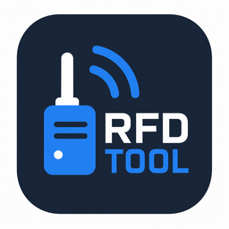

# RFDTool

<p align="center">
  
</p>

RFDTool is a desktop utility for inspecting and configuring RFD900-class and
SiK-compatible radio modems. It talks to a locally connected modem over serial,
then can read and configure both the local radio and the remote radio across the
radio link.

Use it when you want a clearer, safer interface than typing AT commands by hand.

## Download

Prebuilt binaries are attached to the
[latest GitHub release](../../releases/latest):

- `RFDTool-x86_64.AppImage` for Linux on Intel/AMD 64-bit.
- `RFDTool-aarch64.AppImage` for Linux on ARM 64-bit, such as Raspberry Pi OS 64-bit.
- `RFDTool-Setup.exe` for Windows.

The ARM AppImage should work on Raspberry Pi-class boards running a 64-bit Linux
desktop. It has been tested on an Orange Pi running Ubuntu 24.04.

On Linux, make the AppImage executable before running it:

```sh
chmod +x RFDTool-x86_64.AppImage
./RFDTool-x86_64.AppImage
```

On Windows, download and run:

```text
RFDTool-Setup.exe
```

Windows users do not need to install SQGI, Ooblerg, MSYS2, MinGW, GTK, or any
developer tooling just to run RFDTool. The installer contains what the app needs.

Ooblerg is only needed if you want to run or modify RFDTool from source on
Windows.

The default serial device is `/dev/ttyUSB0` at `57600` baud. On Windows, choose
the appropriate `COM` port, such as `COM3`, `COM4`, or whichever port your radio
appears as.

## Quick Start

1. Plug the local radio modem into your computer.
2. Power the remote radio and make sure the radio link is up.
3. Start RFDTool.
4. Choose the serial port and baud rate, then connect.
5. Click the local and remote refresh buttons to read firmware and settings.
6. Edit the settings you need.
7. Use `Apply Local` or `Apply Remote` to write changes to the running radio.
8. Use `Save Both` to persist applied changes to EEPROM.
9. Use `Save + Reboot` when firmware or radio-critical settings need a restart.

If you are changing settings that must match on both radios, apply the remote
side first. If the link drops after changing only the local side, RFDTool may no
longer be able to reach the remote radio.

## Local, Remote, Apply, Save

RFDTool shows the two sides separately:

- Local is the modem connected directly to your computer.
- Remote is the modem reached through the radio link.

RFD and SiK firmware make an important distinction between applying and saving:

- `Apply` writes the setting into the running radio.
- `Save` writes the current settings to EEPROM so they survive power loss.
- `Reboot` restarts the modem so startup-time settings take effect.

For remote changes, RFDTool sends `RT...` commands through the local modem. That
requires a working radio link and can take longer than local `AT...` commands,
especially after rebooting the remote radio.

## Features

- Connect to local RFD/SiK radios over a serial port.
- Read local and remote firmware information.
- Read, edit, stage, apply, save, and reboot supported modem parameters.
- Show which settings are reported by the connected firmware.
- Configure AES keys, including generated random 128-bit or 256-bit keys.
- Run RSSI/TDM diagnostics and graph RSSI/noise over a rolling 60 second window.
- Export and import JSON configuration profiles.
- Send manual AT commands from the built-in terminal.

## Troubleshooting

### RFDTool cannot open the serial port on Linux

Check the device ownership:

```sh
ls -l /dev/ttyUSB0
id
```

Serial devices are commonly owned by a group such as `dialout`. Add your user to
the device group, then log out and back in:

```sh
sudo usermod -aG dialout "$USER"
```

Use the actual group shown by `ls -l` if the device is not owned by `dialout`.

### RFDTool cannot open the serial port on Windows

Make sure you selected the correct `COM` port.

You can check the port in Windows Device Manager under:

```text
Ports (COM & LPT)
```

Also make sure no other application is currently using the modem. Serial ports
are usually exclusive, so tools such as Mission Planner, MAVProxy, another
terminal, or another RFDTool instance may block access.

### Local refresh works, but remote refresh does not

Check that:

- the remote radio is powered;
- both antennas are connected;
- the radio link is actually up;
- both radios still agree on link-critical settings.

Settings that commonly need to match include:

- network ID
- air speed
- frequency range
- channel count
- ECC
- MAVLink framing
- encryption

If a setting change breaks the radio link, connect to the affected radio
directly over serial and restore compatible settings.

## Safety

Radio settings are regulated. Do not use this tool to bypass certified
frequency, region, duty-cycle, or transmit-power limits.

Some settings need to match on both radios, including network ID, air speed,
frequency range, channel count, ECC, MAVLink framing, and encryption. Changing
only one side can intentionally break the link until the other side is updated.

## Developers

RFDTool is written in SQGI/Squirrel, uses GTK 4 for the interface, and uses the
GSerial native module for serial port access.

The normal source workflow is:

```sh
sqgi main.nut
```

Release packaging is handled by `sqgipkg` and GitHub Actions.

## Windows development with Ooblerg

The recommended Windows development setup is
[Ooblerg](https://ooblerg.xyz/).

Ooblerg is a Windows package manager and MinGW-w64 sysroot for SQGI, GTK4,
Vala, Meson, pkg-config, GStreamer, and related native app development. It lets
you install the tools and libraries RFDTool needs into a managed sysroot, then
run the app from Command Prompt, PowerShell, or VS Code.

This is the easiest way to hack on RFDTool from Windows without manually setting
up MSYS2, GTK, MinGW, pkg-config paths, or native library search paths.

### Setup

1. Install [Ooblerg](https://ooblerg.xyz/).
2. Launch Ooblerg.
3. Refresh the package index.
4. Install the packages needed by RFDTool:

```text
sqgi
gtk4
gserial
```

5. In Ooblerg, check that the MinGW sysroot is added to `PATH`.
6. Open a fresh Command Prompt, PowerShell window, or VS Code terminal.
7. Clone and run RFDTool:

```sh
git clone https://github.com/supercamel/RFDTool.git
cd RFDTool
sqgi main.nut
```

If `sqgi` is not found, close and reopen your terminal after enabling the
Ooblerg sysroot in `PATH`.

If GTK or GSerial cannot be found, check that `gtk4` and `gserial` are installed
in Ooblerg.

### Useful Windows commands

Run the self-tests:

```sh
sqgi main.nut --self-test
```

Probe a local modem without launching the GUI:

```sh
sqgi main.nut --probe --device=COM3 --baud=57600
```

Exercise the local settings load path from the command line:

```sh
sqgi main.nut --refresh-local --device=COM3 --baud=57600
```

Replace `COM3` with the actual serial port used by your modem.

## Linux development from source

Running directly with `sqgi main.nut` on Linux requires SQGI, GSerial, and GTK 4
runtime packages to be installed on the system.

Install SQGI from <https://github.com/supercamel/sqgi>:

```sh
git clone https://github.com/supercamel/sqgi.git
cd sqgi

sudo apt install cmake build-essential pkg-config \
  libglib2.0-dev libgirepository1.0-dev libffi-dev libcairo2-dev

cmake -S . -B build -DCMAKE_BUILD_TYPE=Release
cmake --build build -j"$(nproc)"
sudo cmake --install build --prefix /usr/local
sudo ldconfig
```

Install GSerial from <https://github.com/supercamel/gserial>:

```sh
git clone https://github.com/supercamel/gserial.git
cd gserial

sudo apt install build-essential meson ninja-build pkg-config \
  libglib2.0-dev libgirepository1.0-dev

meson setup build --prefix=/usr/local
meson compile -C build
sudo meson install -C build
sudo ldconfig
```

Install GTK 4 runtime/introspection packages if they are not already present:

```sh
sudo apt install libgtk-4-1 gir1.2-gtk-4.0
```

Then run RFDTool:

```sh
git clone https://github.com/supercamel/RFDTool.git
cd RFDTool
sqgi main.nut
```

## Useful developer commands

Run the self-tests:

```sh
sqgi main.nut --self-test
```

Probe a local modem without launching the GUI:

```sh
sqgi main.nut --probe --device=/dev/ttyUSB0 --baud=57600
```

Exercise the local settings load path from the command line:

```sh
sqgi main.nut --refresh-local --device=/dev/ttyUSB0 --baud=57600
```

On Windows, use a `COM` port instead:

```sh
sqgi main.nut --probe --device=COM3 --baud=57600
```

## Packaging

The `sqgipkg.json` manifest declares GSerial as a native project:

```json
"repo": "https://github.com/supercamel/gserial.git"
```

That means packaged builds can fetch and build GSerial through `sqgipkg`. The
GSerial checkout under `.sqgipkg/native/` is generated build state and is not
committed to this repository.

The manifest defines a Linux architecture matrix for x86_64 and aarch64, plus a
Windows target. Every release artifact can be built from a single Linux host:

- Linux x86_64 AppImage
- Linux aarch64 AppImage
- Windows x86_64 NSIS installer

For normal project releases, you do not need to build these manually. The
`.github/workflows/release.yml` workflow builds all three targets with
`sqgipkg` and uploads them when a `v*` tag is pushed.

To publish a release:

```sh
git tag -a v0.1.0 -m "Release v0.1.0"
git push origin main
git push origin v0.1.0
```

GitHub Actions then builds and uploads the release artifacts.

## Local packaging from Ubuntu

You can also build packages locally from an Ubuntu host.

Check the project first:

```sh
sqgipkg --doctor
```

Build Linux AppImages:

```sh
sqgipkg --target appimage --appimage-arch x86_64
sqgipkg --target appimage --appimage-arch aarch64
```

Build the Windows installer:

```sh
sqgipkg --target win-nsis
```

The aarch64 and Windows targets are cross-compiled. On an x86_64 Ubuntu host,
install the cross toolchains first:

```sh
sudo apt install gcc-aarch64-linux-gnu g++-aarch64-linux-gnu qemu-user-static \
  mingw-w64 nsis
```

`sqgipkg` downloads the matching sysroots, builds the SQGI runtime and GSerial
for each target, and writes the release artifacts under:

```text
dist-linux-x86_64/
dist-linux-aarch64/
dist-windows-x86_64/
```

## Developer setup summary

For users:

```text
Download RFDTool-Setup.exe or the AppImage.
```

For Windows developers:

```text
Install Ooblerg, install sqgi + gtk4 + gserial, then run sqgi main.nut.
```

For Linux developers:

```text
Install/build SQGI, install/build GSerial, install GTK4, then run sqgi main.nut.
```

For releases:

```text
Push a v* tag and let GitHub Actions build the AppImages and Windows installer.
```
